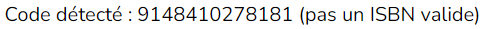

# Application web pour gérer sa bibliothèque personnelle de livres

## Table des matières
1. [Présentation du projet](#presentation-du-projet)
2. [Prérequis](#prérequis)
3. [Installation](#installation)
4. [Exécution](#exécution)
5. [Crédits](#crédits)

---

## Présentation du projet

### Introduction

Ce projet sert de base de données pour enregistrer les livres que l'on a déjà lus.

### Ajouter un livre

Pour accéder à la page permettant d'ajouter un nouveau livre à la base de données, cliquez sur "Ajouter un livre" depuis le menu, ou sur "Ajouter" dans le bandeau en haut des autres pages de l'application.


Ensuite il y a deux manières d'ajouter un nouveau livre :

1. Numéro ISBN

    La première consiste simplement à rentrer le numéro ISBN (International Standard Book Number), qui est un code de 13 caractères commençant par 978 ou 979, dans la zone de texte puis de cliquer sur "Ajouter le livre".

    

2. Code-barre
    
    La deuxième consiste à scanner la code-barre du livre (qui correspond en fait au numéro ISBN). Une fois que la caméra aura détécté le code-barre, un message va indiquer si l'ISBN trouvé est valide, et si c'est le cas si le livre correspondant est présent dans la base de données ou non. S'il n'est pas présent, le livre sera alors ajouté à la base de données

    

Si le numéro ISBN est invalide, l'un des deux messages suivants va apparaître :



Si le livre n'est pas déjà présent dans la base de données, ce message va s'afficher :


Sinon, celui-ci va apparaître :


### Consulter la liste des livres

Pour accéder à la page permettant de consulter la liste des livres de la base de données, cliquez sur "Consulter la liste des livres" depuis le menu, ou sur "Catalogue" dans le bandeau en haut des autres pages de l'application.


Par défaut tous les livres sont affichés, mais on peut recherche un ou plusieurs livres par titre, auteur, ou les deux


### Voir un livre

Une fois qu'un livre est dans la base de données, si on clique sur le titre du livre depuis le catalogue, une page s'ouvre avec le titre du livre, son auteur et la page de couverture.


## Prérequis

Listez les prérequis nécessaires pour utiliser ce projet (langages, dépendances, etc.) :

- **Langage(s) :** Python 3.10.12
- **Package :** sqlite3 3.37.2 (à titre indicatif)
- **Dépendances :** Voir le fichier `requirements.txt`

## Installation

1. Clonez ce dépôt :
   ```bash
   git clone https://github.com/Discobluff/livresMediatheque
   cd livresMediatheque
   ```

2. Créez un environnement virtuel :
    ```bash
    python3 -m venv venv
    source venv/bin/activate
    ```

3. Installez les dépendances :
    ```bash
    pip install -r requirements.txt
    ```

4. Créez la base de données :
    ```bash
    sqlite3 livres.db < scheme.sql
    ```

## Exécution

1. Lancer l'application :

    ```bash
    python3 app.py
    ```

2. Se rendre sur l'url http://127.0.0.1:5000/ à l'aide d'un navigateur

## Crédits

1. J'ai utilisé https://github.com/serratus/quaggaJS pour la lecture des code-barres

2. J'ai utilisé le site https://isbndb.com pour obtenir les informations d'un livre à partir de son numéro ISBN